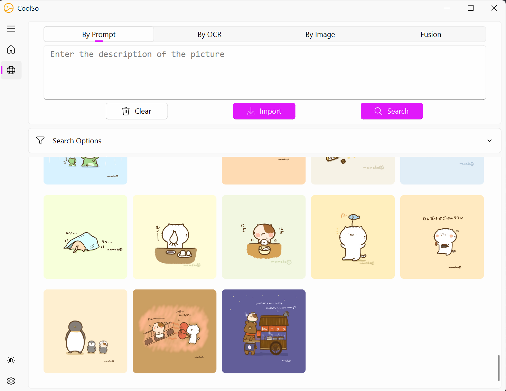

# CoolSo
An image search engine capable of performing semantic searches, finding images based on other images, and identifying images through text recognized by OCR



## Dependencies

Before starting, make sure u have python3 installed on your computer. If you have CUDA installed that's even better, but it doesn't matter if you don't.

```shell
pip3 install -r requirements.txt
```

For [PaddleOCR](https://github.com/PaddlePaddle/PaddleOCR), please run:

```shell
python3 -m pip install paddlepaddle -i https://mirror.baidu.com/pypi/simple
pip install "paddleocr>=2.0.1" # recommended
```

Finally, install [mongodb community server](https://www.mongodb.com/try/download/community).

Now we're ready to embark on our CoolSo journey!

## Usage

Start mongodb

```shell
cd mongo_sample
./start.sh
```

Run the command below and you will get a GUI.

```python
python main_wondow.py
```

### Configuration

+ Local picture library

  Please configure a local folder path in configuration and restart.

+ On-line picture library

  You can also just search images on the Internet (on [pixiv](https://www.pixiv.net/) for now). Please add your `uid` and `cookie`

  + `uid`

    Open your profile on pixiv, and the URL will be `https://www.pixiv.net/en/users/{your uid}`

  + `cookie`

    open <https://www.pixiv.net/ranking.php> - F12 - Network - refresh - ranking.php - copy the cookie

## Features

There are mainly four ways to search images:

+ By prompt

  English support

+ By OCR

  English and Chinese support, fuzzy search support

+ By image

  + `png`
  + `jpg`
  + `gif`
  + `bmp`

+ Fusion

  Search based on feature fusion of English prompts and images

And for pixiv research, we offer:

+ search your bookmarks
+ search a certain artist's works
+ search by keyword

## TODO

- [ ] Search history
- [ ] Replace database with a vector database such as Faiss, milvus, qdrant and so on
- [ ] Multi-language prompt

## Acknowledgement

+ [CLIP](https://github.com/openai/CLIP)
+ [PaddleOCR](https://github.com/PaddlePaddle/PaddleOCR)

+ [clip-image-search](https://github.com/atarss/clip-image-search)
+ [PixivCrawler](https://github.com/CWHer/PixivCrawler)

## Authors

+ [wytili](https://github.com/wytili)
+ [BeaCox](https://github.com/BeaCox)
+ [G-AOi](https://github.com/G-AOi)
+ [glimmeringlight](https://github.com/glimmeringlight)
+ [Sora-Yanl](https://github.com/Sora-Yanl)